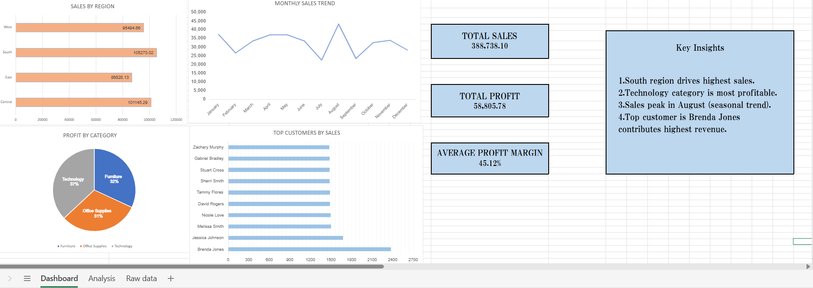

# sales-data-analysis
Sales Data Analysis using Excel (Dashboard + Insights)
Overview
This project analyzes sales data using Excel. It includes data cleaning, analysis using pivot tables, and a dashboard to visualize key insights.

Tools Used:
MS Excel
Pivot Tables
Data Cleaning
Data Visualization

Key Insights:
South region has highest sales
Technology category is most profitable
Sales peak in August
Top customer: Brenda Jones

Dashboard:

Files Included:
Sales dataset (Excel)
Dashboard screenshot
